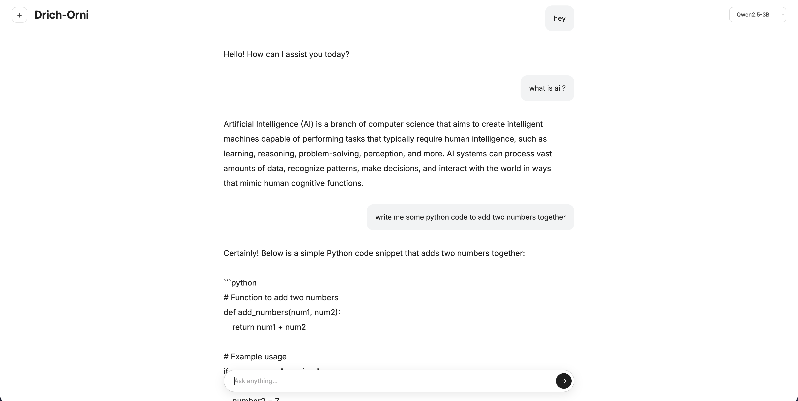

# Drich-Orni 

Drich-Orni is a minimal, fast chat interface for talking to open-source LLMs, with a decoupled architecture: a static frontend hosted on **GitHub Pages** and a Flask inference API hosted on a **Hugging Face Space** (Docker, free tier).

Live demo: [QR Code Studio](https://drichdev.github.io/drich-Orni/)

### Preview


## Why this architecture?

Free Hugging Face Spaces have limited RAM and no GPU. Serving both a heavy HTML/Gradio UI *and* a large language model from the same container quickly hits resource limits. Orni splits the two concerns:

- **Frontend (GitHub Pages):** plain HTML/CSS/JS, no framework, no build step. Free, fast, and infinitely cacheable.
- **Backend (Hugging Face Space):** a lightweight Flask API that loads one model at a time and exposes simple JSON endpoints.

This keeps the Space focused purely on inference, and lets the UI be swapped, themed, or redeployed independently.



## Features

- Clean chat UI: user messages in a gray bubble, assistant replies as plain text — no clutter, no avatars.
- Centered chat input with a send button.
- Model switcher (top-right) to pick between several lightweight instruct models.
- "New chat" button (`+`) to clear the conversation history.
- Animated loading spinner while the model generates a response.
- Automatic stripping of `<think>...</think>` reasoning blocks before displaying the answer (for models that expose chain-of-thought).

## Project structure

```
.
├── frontend/              # Deployed to GitHub Pages
│   ├── index.html
│   ├── style.css
│   └── script.js
│
└── backend/               # Deployed to Hugging Face Space (Docker)
    ├── app.py             # Flask routes: /, /generate, /clear, /models
    ├── model.py           # Model loading / switching logic
    ├── requirements.txt
    └── Dockerfile
```

## How it works

1. The frontend sends a `POST /generate` request to the Hugging Face Space with the user's message and the selected model ID.
2. The backend loads the requested model (unloading the previous one to free RAM if it changed), runs `generate()`, strips any reasoning block, and returns the answer as JSON.
3. The frontend renders the response in the chat window.

```
[Browser] --fetch--> [GitHub Pages: HTML/CSS/JS]
                            |
                            | POST /generate (CORS)
                            v
                  [Hugging Face Space: Flask + model]
```

## Supported models

Only one model is kept in memory at a time to stay within the free Space's RAM budget. Switching models in the dropdown unloads the current one and loads the new one (a short delay is expected).

| Key     | Model                              |
|---------|-------------------------------------|
| `qwen`  | Qwen2.5-3B-Instruct                |
| `llama` | Llama-3.2-3B-Instruct              |
| `smol`  | SmolLM2-1.7B-Instruct              |


## Limitations

- Free Hugging Face Spaces run on CPU only — generation is noticeably slower than on GPU-backed inference.
- Switching models clears effective context compatibility; it's recommended to clear the conversation when changing models.
- The Flask dev server is used as-is; for production-grade traffic, swap to a WSGI server (e.g. Gunicorn).

## License

MIT — feel free to fork, adapt, and reuse.